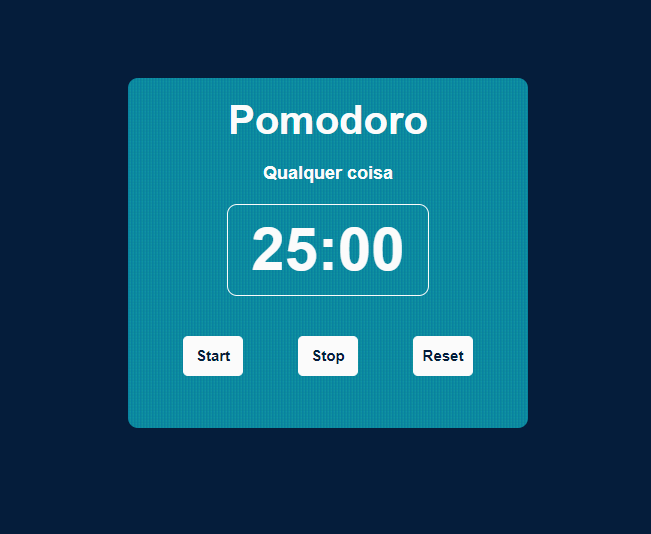

# Pomodoro

> Aplicação feita utilizando HTML5, CSS3 e Javascript, onde utilizo o javascript em botões interativos para iniciar, pausar e resetar o cronometro.

### Ajustes e melhorias

O projeto ainda está em desenvolvimento e as próximas atualizações serão voltadas nas seguintes tarefas:

- [ ] Incerir opções de tempo 
- [ ] Incerir pausas
- [ ] Incerir musica
- [ ] Incerir opções de musicas

## 🚀 Acessando o projeto Pomodoro

Para acessar o <Pomodoro>, basta [clicar aqui](https://pomodoro-one-nu.vercel.app/)

## 📝 Licença

Esse projeto está sob licença. Veja o arquivo [LICENÇA](LICENSE.md) para mais detalhes.

[⬆ Voltar ao topo](#Pomodoro) 
